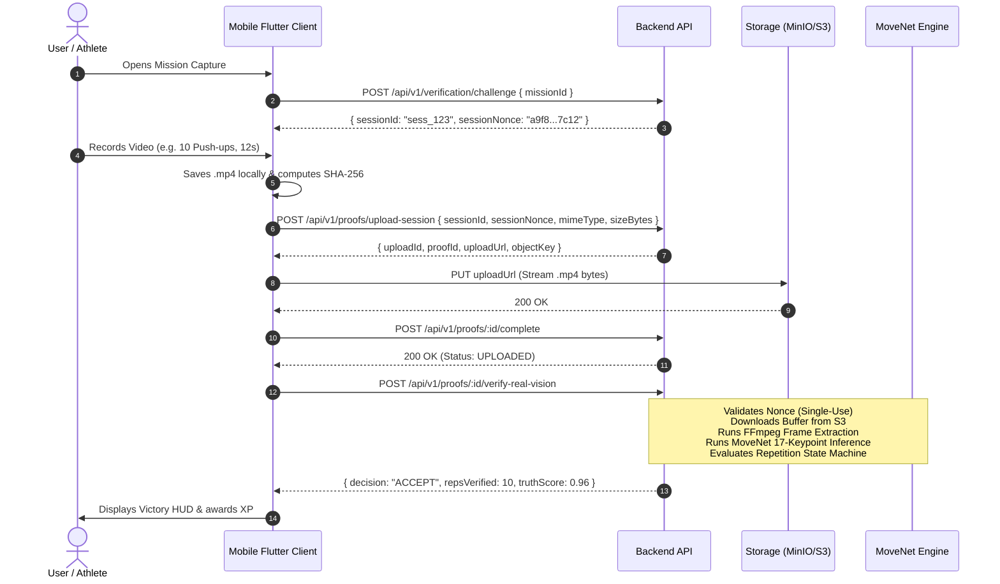

# Habitat Mobile Camera Capture & Real-Vision Verification Subsystem
## Technical Specification & Implementation Blueprint (Track E Part 2)

---

## 1. Executive Summary & Problem Definition

### 1.1 Context & Current State
The **Habitat Backend** has achieved full production readiness for computer vision verification:
- Real **MoveNet-Lightning** single-pose inference running on raw RGB frame buffers via TensorFlow.js CPU / WASM.
- Real **FFmpeg** temporal frame extraction with raw pixel fallback.
- Cryptographic **session challenge nonce binding** (`POST /api/v1/verification/challenge` $\leftrightarrow$ `POST /api/v1/proofs/:id/verify-real-vision`) ensuring single-use freshness and replay-attack rejection.
- Zero-trust security: JWT `authGuard`, IDOR ownership enforcement, rate-limiting (10 req/min/user), and local model weight caching (`MOVENET_MODEL_DIR`).

### 1.2 The Client-Side Bottleneck
On the **Habitat Flutter Mobile Client** (`apps/mobile`), while the foundational networking layer (`HabitatApiClient`, `AuthTokenManager`, and `VerificationService`) has been established, **`CameraService` currently fabricates proofs as template strings**:
```dart
// apps/mobile/lib/features/proof/data/camera_service.dart (Current Placeholder)
final rawString = 'HABITAT_PHOTO:$taskId:$attemptId:${timestamp.toIso8601String()}:front=$_isFront';
final bytes = utf8.encode(rawString);
final checksum = sha256.convert(bytes).toString();
return CaptureResult(
  filePath: 'app_storage://proofs/${taskId}_${attemptId}_photo.jpg', // Non-existent file
  sha256Checksum: checksum,
);
```
No actual camera hardware, video encoder, or physical media file is touched. Consequently, proofs cannot be verified by the backend because no real pixel data is captured.

### 1.3 Target State
Upgrade `apps/mobile` with a **hardware-integrated Camera Subsystem** that:
1. Requests platform permissions gracefully (Camera + Microphone).
2. Initializes `CameraController` with 720p 30fps resolution tuned for server-side pose extraction.
3. Records actual `.jpg` images and `.mp4` video files to local app sandbox storage (`path_provider`).
4. Computes physical SHA-256 byte checksums.
5. Executes the full single-use challenge $\rightarrow$ upload-session $\rightarrow$ storage $\rightarrow$ `verify-real-vision` API handshake with seamless offline fallback.

---

## 2. System Architecture & Component Breakdown

```
                                  MOBILE CLIENT (Flutter)
┌──────────────────────────────────────────────────────────────────────────────────────────┐
│                                                                                          │
│  ┌───────────────────────┐         ┌────────────────────────┐                            │
│  │ PermissionManager     │ ──────> │ NativeCameraController │                            │
│  │ (Camera + Microphone) │         │ (camera: ^0.10.5+9)    │                            │
│  └───────────────────────┘         └───────────┬────────────┘                            │
│                                                │                                         │
│                                                ▼                                         │
│                                    ┌───────────────────────┐                             │
│                                    │  ProofFileStore       │                             │
│                                    │  (path_provider)      │                             │
│                                    │  • Real .mp4 / .jpg   │                             │
│                                    │  • Physical SHA-256   │                             │
│                                    └───────────┬───────────┘                             │
│                                                │                                         │
│                                                ▼                                         │
│                                    ┌───────────────────────┐                             │
│                                    │  VerificationService  │                             │
│                                    └───────────┬───────────┘                             │
│                                                │                                         │
└────────────────────────────────────────────────┼─────────────────────────────────────────┘
                                                 │ HTTPS
                                                 ▼
┌──────────────────────────────────────────────────────────────────────────────────────────┐
│                                 HABITAT BACKEND API                                      │
│                                                                                          │
│  1. POST /api/v1/verification/challenge  ──> { sessionId, sessionNonce }                 │
│  2. POST /api/v1/proofs/upload-session   ──> { uploadUrl, proofId }                      │
│  3. PUT  {uploadUrl}                     ──> Uploads .mp4 / .jpg to Storage (MinIO/S3)   │
│  4. POST /api/v1/proofs/:id/complete     ──> Finalizes storage upload                    │
│  5. POST /api/v1/proofs/:id/verify-real-vision                                           │
│          ├── Nonce Validation (SessionChallengeService)                                  │
│          ├── Storage I/O (StorageProvider.getObjectBuffer)                               │
│          ├── Frame Extraction (FFmpeg / raw pixel stream)                                │
│          ├── MoveNet Pose Estimation (TfjsVisionProvider)                                │
│          └── VerificationEngine Decision (ACCEPT / REVIEW / REJECT)                      │
└──────────────────────────────────────────────────────────────────────────────────────────┘
```

---

## 3. Required File Modifications & Implementations

### File 1: Hardware Camera Controller (`native_camera_controller.dart`)
**Location**: `apps/mobile/lib/core/platform/media/native_camera_controller.dart`

```dart
// Native Camera Hardware Controller with Lifecycle & Orientation Management
import 'dart:io';
import 'package:camera/camera.dart';
import 'package:flutter/foundation.dart';
import 'package:flutter/services.dart';

class NativeCameraController with WidgetsBindingObserver {
  CameraController? _controller;
  List<CameraDescription> _cameras = [];
  int _selectedCameraIndex = 0;
  bool _isInitialized = false;
  bool _isRecording = false;

  CameraController? get controller => _controller;
  bool get isInitialized => _isInitialized && _controller != null && _controller!.value.isInitialized;
  bool get isRecording => _isRecording;
  bool get isFrontCamera => _cameras.isNotEmpty && _cameras[_selectedCameraIndex].lensDirection == CameraLensDirection.front;

  Future<void> initialize({CameraLensDirection initialLens = CameraLensDirection.back}) async {
    WidgetsBinding.instance.addObserver(this);
    try {
      _cameras = await availableCameras();
      if (_cameras.isEmpty) {
        throw Exception('NO_CAMERAS_AVAILABLE: No physical camera sensors detected on device');
      }

      _selectedCameraIndex = _cameras.indexWhere((c) => c.lensDirection == initialLens);
      if (_selectedCameraIndex == -1) _selectedCameraIndex = 0;

      await _initController(_cameras[_selectedCameraIndex]);
    } catch (e) {
      debugPrint('[NativeCameraController] Init error: $e');
      rethrow;
    }
  }

  Future<void> _initController(CameraDescription camera) async {
    final prevController = _controller;
    final newController = CameraController(
      camera,
      ResolutionPreset.medium, // 720p: Optimal for MoveNet 192x192 downsampling without memory blowup
      enableAudio: true,
      imageFormatGroup: Platform.isAndroid ? ImageFormatGroup.jpeg : ImageFormatGroup.bgra8888,
    );

    await prevController?.dispose();
    _controller = newController;

    await newController.initialize();
    await newController.lockCaptureOrientation(DeviceOrientation.portraitUp);
    _isInitialized = true;
  }

  Future<void> switchCamera() async {
    if (_cameras.length < 2) return;
    _selectedCameraIndex = (_selectedCameraIndex + 1) % _cameras.length;
    await _initController(_cameras[_selectedCameraIndex]);
  }

  Future<XFile> takePicture() async {
    if (!isInitialized || _controller!.value.isTakingPicture) {
      throw StateError('Camera not ready to capture picture');
    }
    return await _controller!.takePicture();
  }

  Future<void> startVideoRecording() async {
    if (!isInitialized || _controller!.value.isRecordingVideo) {
      throw StateError('Camera not ready to start video recording');
    }
    await _controller!.startVideoRecording();
    _isRecording = true;
  }

  Future<XFile> stopVideoRecording() async {
    if (!isInitialized || !_controller!.value.isRecordingVideo) {
      throw StateError('Camera is not currently recording video');
    }
    final xfile = await _controller!.stopVideoRecording();
    _isRecording = false;
    return xfile;
  }

  @override
  void didChangeAppLifecycleState(AppLifecycleState state) {
    if (_controller == null || !_controller!.value.isInitialized) return;

    if (state == AppLifecycleState.inactive || state == AppLifecycleState.paused) {
      _controller?.dispose();
      _isInitialized = false;
    } else if (state == AppLifecycleState.resumed) {
      _initController(_cameras[_selectedCameraIndex]);
    }
  }

  Future<void> dispose() async {
    WidgetsBinding.instance.removeObserver(this);
    await _controller?.dispose();
    _controller = null;
    _isInitialized = false;
  }
}
```

---

### File 2: Real Hardware Camera Service (`camera_service.dart`)
**Location**: `apps/mobile/lib/features/proof/data/camera_service.dart`

```dart
// Hardware-Integrated Camera Service with Physical File Persistence & SHA-256 Hashing
import 'dart:io';
import 'package:camera/camera.dart';
import 'package:crypto/crypto.dart';
import 'package:path/path.dart' as p;
import 'package:path_provider/path_provider.dart';
import '../../../core/platform/media/native_camera_controller.dart';
import '../domain/capture_result.dart';

class RealCameraService {
  final NativeCameraController _controller = NativeCameraController();
  DateTime? _recordingStartedAt;

  NativeCameraController get controller => _controller;
  bool get isInitialized => _controller.isInitialized;
  bool get isRecordingVideo => _controller.isRecording;
  bool get isFrontCamera => _controller.isFrontCamera;

  Future<void> initialize({CameraLensDirection initialLens = CameraLensDirection.back}) async {
    await _controller.initialize(initialLens: initialLens);
  }

  Future<void> dispose() async {
    await _controller.dispose();
  }

  Future<void> switchCamera() async {
    await _controller.switchCamera();
  }

  Future<CaptureResult> takePhoto({
    required String taskId,
    required String attemptId,
  }) async {
    final XFile xfile = await _controller.takePicture();
    final bytes = await xfile.readAsBytes();
    final checksum = sha256.convert(bytes).toString();

    // Persist to app documents cache directory
    final appDir = await getApplicationDocumentsDirectory();
    final proofsDir = Directory(p.join(appDir.path, 'proofs'));
    if (!await proofsDir.exists()) await proofsDir.create(recursive: true);

    final timestamp = DateTime.now();
    final targetPath = p.join(proofsDir.path, '${taskId}_${attemptId}_${timestamp.millisecondsSinceEpoch}.jpg');
    await File(xfile.path).copy(targetPath);

    return CaptureResult(
      filePath: targetPath,
      mimeType: 'image/jpeg',
      byteSize: bytes.length,
      sha256Checksum: checksum,
      capturedAt: timestamp,
      isFrontCamera: _controller.isFrontCamera,
      metadata: {
        'sourcePath': xfile.path,
        'lens': _controller.isFrontCamera ? 'front' : 'back',
        'width': 1280,
        'height': 720,
      },
    );
  }

  Future<void> startVideoRecording() async {
    await _controller.startVideoRecording();
    _recordingStartedAt = DateTime.now();
  }

  Future<CaptureResult> stopVideoRecording({
    required String taskId,
    required String attemptId,
  }) async {
    final XFile xfile = await _controller.stopVideoRecording();
    final timestamp = DateTime.now();
    final durationSeconds = _recordingStartedAt != null
        ? timestamp.difference(_recordingStartedAt!).inSeconds
        : 0;
    _recordingStartedAt = null;

    final bytes = await xfile.readAsBytes();
    final checksum = sha256.convert(bytes).toString();

    final appDir = await getApplicationDocumentsDirectory();
    final proofsDir = Directory(p.join(appDir.path, 'proofs'));
    if (!await proofsDir.exists()) await proofsDir.create(recursive: true);

    final targetPath = p.join(proofsDir.path, '${taskId}_${attemptId}_${timestamp.millisecondsSinceEpoch}.mp4');
    await File(xfile.path).copy(targetPath);

    return CaptureResult(
      filePath: targetPath,
      mimeType: 'video/mp4',
      byteSize: bytes.length,
      sha256Checksum: checksum,
      durationSeconds: durationSeconds,
      capturedAt: timestamp,
      isFrontCamera: _controller.isFrontCamera,
      metadata: {
        'sourcePath': xfile.path,
        'lens': _controller.isFrontCamera ? 'front' : 'back',
        'fps': 30,
        'codec': 'h264',
      },
    );
  }
}
```

---

### File 3: Live Viewfinder Screen (`proof_camera_screen.dart`)
**Location**: `apps/mobile/lib/features/proof/presentation/proof_camera_screen.dart`

**Key Responsibilities**:
1. Render live `CameraPreview(_cameraService.controller.controller!)`.
2. Display bounding alignment guidelines ("Align full body in frame for push-ups").
3. Display live duration timer with minimum 3-second threshold indicator.
4. Lens toggle button (`switchCamera`).
5. Shutter action with haptic feedback.

---

## 4. End-to-End Handshake Flow



---

## 5. Error Recovery & Edge Case Matrix

| Edge Case | Failure Mode | Mitigation & Recovery |
|---|---|---|
| **Camera Permission Denied** | `PermissionDeniedException` | Present explanation dialog with deep link to `openAppSettings()`. |
| **Airgapped / No Network** | Network timeout on `/challenge` | Gracefully fall back to local `EvidenceVerificationEngine` with `flags: ['OFFLINE_FALLBACK']`. |
| **Video Under 3 Seconds** | MoveNet insufficient temporal window | Viewfinder displays warning; shutter button disables until 3.0s elapsed. |
| **Nonce Expiry (>10m)** | `CHALLENGE_EXPIRED` (400) | App automatically requests a fresh challenge before initiating upload session. |
| **Low Light (<15 Lux)** | Low keypoint confidence | Display live warning banner "Low lighting detected — turn on room lights". |

---

## 6. Implementation Verification Checklist

- [ ] **Android Permissions**: Verify `android.permission.CAMERA` and `android.permission.RECORD_AUDIO` in `AndroidManifest.xml` (✅ Pre-configured).
- [ ] **iOS Permissions**: Verify `NSCameraUsageDescription` and `NSMicrophoneUsageDescription` in `Info.plist` (✅ Pre-configured).
- [ ] **Physical File I/O**: Verify files are copied to `getApplicationDocumentsDirectory()/proofs/` and verified with `File(path).exists()`.
- [ ] **Challenge Binding**: Verify `sessionId` and `sessionNonce` are passed to `/proofs/upload-session` and validated on backend.
- [ ] **Offline Resilience**: Disconnect device WiFi/cellular $\rightarrow$ verify mission completes with offline fallback flag.
